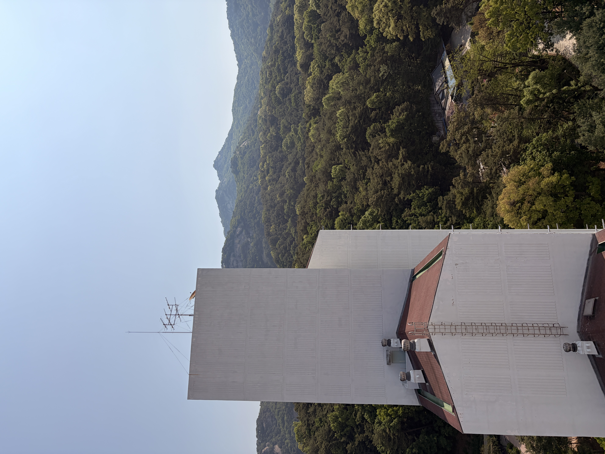
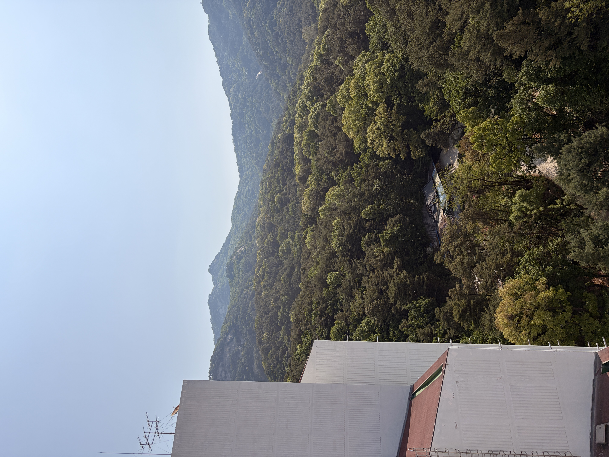
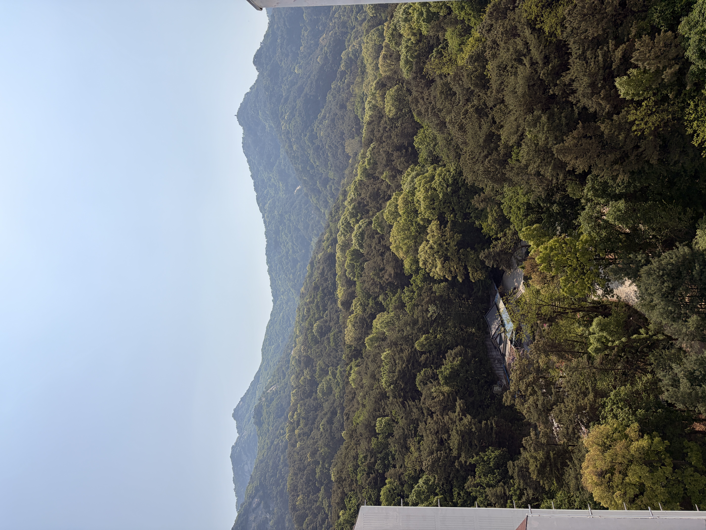
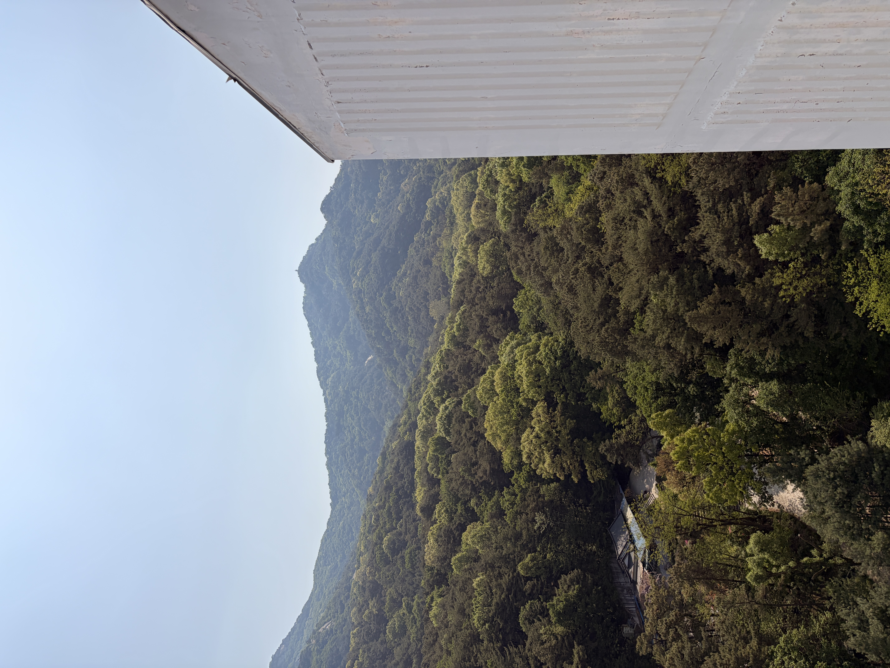
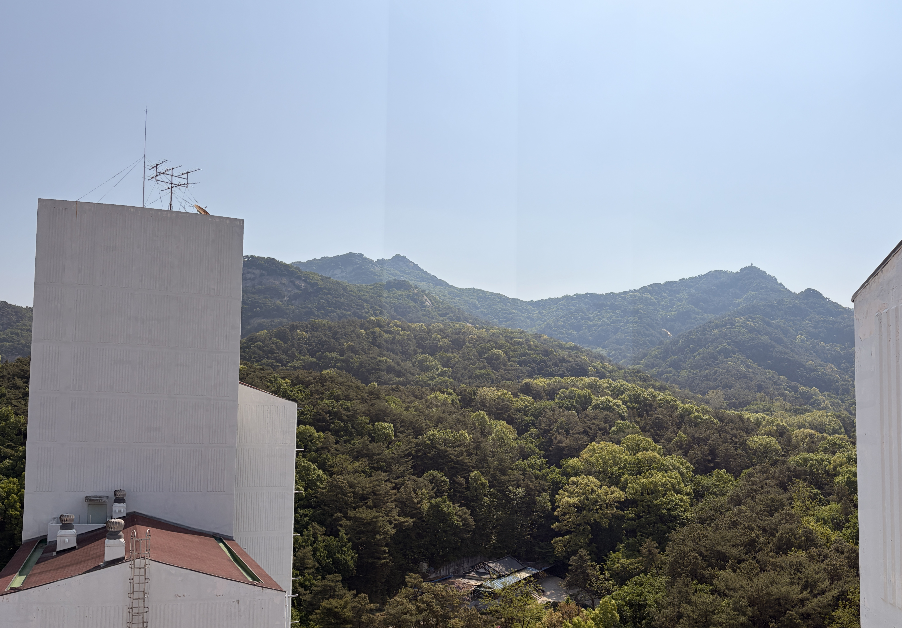
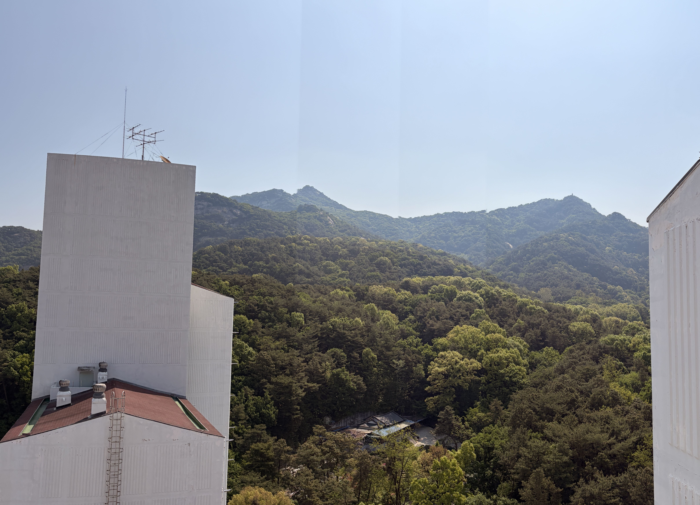
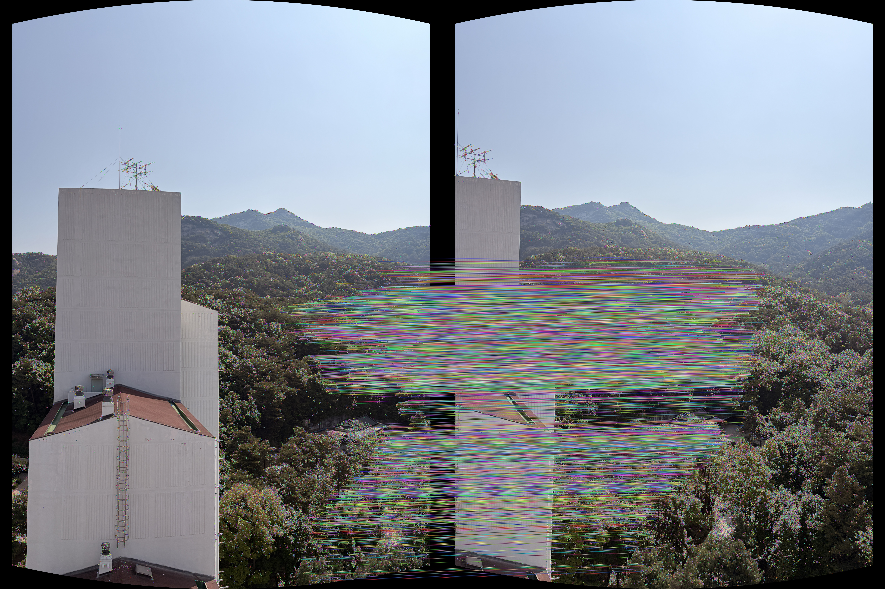
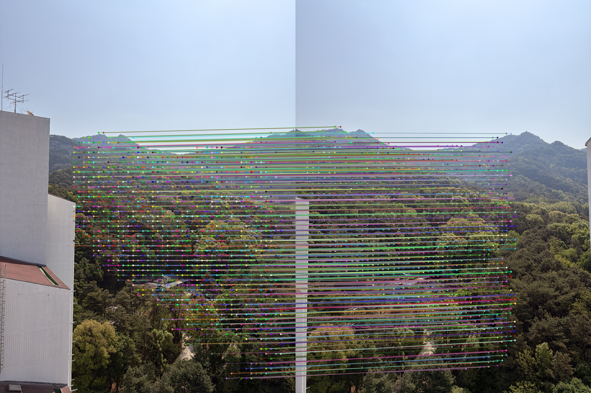

# Image Stitching & Panoramic Blending

3장 이상의 다중 이미지를 원통형 좌표계(Cylindrical Projection)와 심화 블렌딩 기법을 활용하여 자연스러운 하나의 파노라마 이미지로 정합하는 컴퓨터 비전 스티칭 툴입니다. 

기본적인 OpenCV 특징점 방식(BRISK)과 더불어 최신 딥러닝 방식(LoFTR)을 모두 지원하며, 파노라마 합성 시 흔히 발생하는 잔상(Ghosting)과 원근 왜곡을 원천 차단하기 위해 상용 소프트웨어 급의 심화 최적화 기법을 직접 구현하여 적용했습니다.

## 데모 미리보기

### 1. 입력 이미지 (원본 사진)

스마트폰 등을 이용해 제자리에서 회전하며 분할 촬영한 원본 이미지들입니다. 이 4장의 사진들이 어떻게 하나의 완벽한 풍경으로 합쳐지는지 아래에서 확인해보세요.

<p align="center">
  
  
  
  
</p>

### 2. 파노라마 정합 결과 (최종 결과물)

**[심화] LoFTR 딥러닝 파노라마 결과**

*(손떨림과 고스팅이 완벽히 제어된 고해상도 딥러닝 파노라마 결과물)*

**[기본] BRISK 특징점 파노라마 결과**

*(전통적 방식으로도 Refinement와 Voronoi Seam 최적화를 거쳐 잔상 없이 선명하게 완성된 고품질 결과물)*

### 3. 매칭 품질 비교 (BRISK vs LoFTR)

**[기본] OpenCV BRISK 특징점 매칭**

*(원본 고해상도 전체에서 코너(Corner) 위주로 추출하여 선의 개수는 많지만, 텍스처가 강한 특정 바위 영역 등에만 과도하게 밀집되어 있어 매칭의 불균형이 있는 모습)*

**[심화] PyTorch LoFTR 딥러닝 매칭**

*(VRAM 메모리 최적화를 위해 640x480 저해상도로 연산하여 선의 개수는 적어 보이지만, 질감이 부족한 평야나 구름 영역까지 포함하여 이미지 전 영역에 걸쳐 구조적으로 균일하고(Uniform) 압도적인 신뢰도로 매칭된 모습)*

### 4. 단계별 파이프라인 시각화 (3-Step Visualization)

정합이 진행될 때마다 3단계 구조(원본 -> 매칭 -> 현재 캔버스)를 요약하여 보여줍니다.


결과물 원본 파일 경로:
- **딥러닝 정합 결과**: `data/loftr_panorama_result.jpg`
- **기본 정합 결과**: `data/panorama_result.jpg`

---

## 주요 기능 (Key Features)

- **Cylindrical Projection (원통형 투영)**: 카메라를 Panning하며 찍은 다중 이미지들을 정합할 때, 양 끝 가장자리가 비정상적으로 늘어나는 렌즈 왜곡 현상을 방지합니다.
- **딥러닝 특징점 매칭 (LoFTR)**: `main_loftr.py`에서 Transformer 구조를 활용한 매칭 모델을 적용하여 극강의 픽셀 단위 매칭 정확도를 보장합니다.
- **RANSAC Least Squares Refinement (최소제곱 보정)**: RANSAC이 뽑은 단 4개의 가설 점만을 맹신하지 않고, 걸러진 **전체 정상 매칭점(Inliers)을 SVD 연산에 대입**하여 변환 행렬(Homography)을 한 번 더 깎고 다듬어 오차를 최소화합니다.
- **Center-weighted Voronoi Seam Blending (심화 블렌딩)**: 겹침 구역을 50:50으로 넓게 평균내어 발생하는 잔상(Ghosting)을 막기 위해, 거리가 정확히 1:1로 만나는 **Voronoi Seam(경계선)** 을 찾고 그 주변 30픽셀에만 얇은 Gaussian Blur를 씌워 티 나지 않게 잔상을 원천 파괴합니다.
- **Auto Inner-Bounding Box Crop (자동 크롭 로직)**: 정합 완료 후 손떨림 궤적에 따라 삐뚤빼뚤해진 가장자리의 검은 여백을 감지하고, 네 방향에서 깔끔한 직사각형 뷰가 될 때까지 깎아 들어가는 `Inner Crop` 알고리즘을 자동 수행합니다.

## 요구 사항 (Requirements)

- Python 3.8 이상
- OpenCV (`pip install opencv-python`)
- NumPy (`pip install numpy`)
- PyTorch & Kornia (`pip install torch kornia` / 딥러닝 버전 사용 시 필수)

## 빠른 시작 (Quick Start)

### 설치
```bash
pip install opencv-python numpy torch kornia
```

### 1. 기본 버전 실행 (OpenCV BRISK 기반)
```bash
python main.py
```
* **특징**: 외부 무거운 라이브러리 없이 CPU만으로도 매우 빠르게 동작하며, Refinement 및 Voronoi Blending 기법이 동일하게 탑재되어 있어 높은 퀄리티를 보여줍니다.

### 2. 심화 딥러닝 버전 실행 (PyTorch LoFTR 기반)
```bash
python main_loftr.py
```
* **특징**: 첫 실행 시 모델 가중치가 자동 다운로드됩니다. Mac 환경의 `mps` 가속을 완벽 지원하며, 상용 스마트폰 파노라마 모드 수준의 극한의 선명도를 자랑합니다.

---

## 📁 파일 구조 (Directory Structure)

```text
image_stitching/
├── data/                               # 원본 사진(IMG_*.JPG) 및 시각화/결과물 저장소
│   ├── IMG_*.JPG
│   ├── panorama_result.jpg             # 기본 버전 결과
│   ├── loftr_panorama_result.jpg       # 딥러닝 버전 결과
│   └── (loftr_)step*_all_visualization.jpg # 단계별 3단 요약 패널
├── homography_estimation_implement.py  # 수제작 RANSAC 및 최소제곱 SVD 연산 모듈
├── image_warping_implement.py          # Homography 기반 Vectorized 이미지 맵핑 모듈
├── main.py                             # BRISK 특징점 매칭 기반 스티칭 메인 런타임
├── main_loftr.py                       # LoFTR 딥러닝 기반 스티칭 메인 런타임
└── README.md
```
