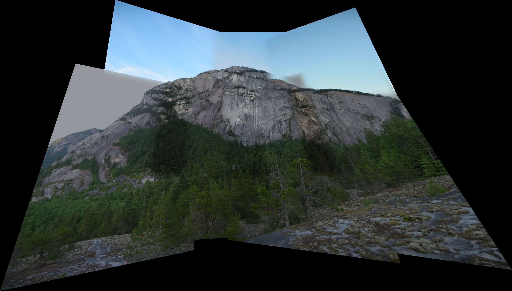
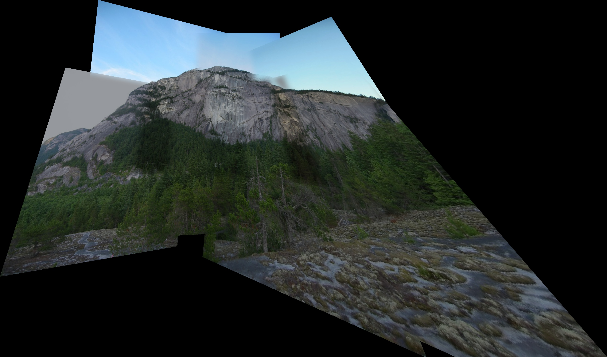

# Image Stitching & Panoramic Blending Pipeline

여러 장의 고해상도 이미지를 하나의 매끄러운 파노라마 뷰로 정합(Stitching)하는 컴퓨터 비전 파이프라인입니다.

본 프로젝트는 OpenCV에서 제공하는 고수준 API(`cv::Stitcher`, `cv::warpPerspective` 등)에 의존하지 않고, 이미지 정합에 필요한 핵심 수학적 변환과 렌더링 엔진을 밑바닥부터 직접 구현(From-scratch Implementation)하는 것을 목표로 개발되었습니다. 특히 2400만 화소 이상의 현대 스마트폰 사진들을 처리할 때 발생하는 심각한 메모리 병목 현상을 해결하기 위해 고도의 최적화 기법들이 적용되어 있습니다.

## 핵심 아키텍처 및 알고리즘

이 파이프라인은 전통적인 특징점 추출 방식과 최신 딥러닝 방식을 모두 지원하며, 상용 소프트웨어 수준의 결과물을 얻기 위해 다양한 심화 알고리즘을 파이프라인 곳곳에 배치했습니다.

### 1. 특징점 추출 및 매칭 (Feature Extraction and Matching)
* **전통적 파이프라인 (main.py)**: 스케일과 회전에 불변하는 BRISK 알고리즘을 사용하여 특징점을 추출합니다. 추출된 특징점들은 Brute-Force Hamming 거리 기반으로 매칭되며, Lowe's Ratio Test를 통해 모호한 매칭쌍을 1차적으로 걸러냅니다.
* **딥러닝 파이프라인 (main_loftr.py)**: PyTorch와 Kornia 라이브러리를 활용하여 LoFTR(Local Feature Matching with Transformers) 모델을 적용했습니다. 코너(Corner) 위주로 특징을 잡는 전통적 방식과 달리, 트랜스포머 구조를 통해 이미지 전체의 문맥을 이해하므로 하늘이나 밋밋한 벽면처럼 텍스처가 부족한 영역에서도 매우 안정적인 밀집(Dense) 매칭 결과를 보여줍니다.

### 2. 강건한 변환 행렬 추정 (Robust Homography Estimation)
* **RANSAC 알고리즘**: 오매칭(Outlier)이 포함된 상태에서 최적의 원근 변환 행렬(Homography)을 찾기 위해 커스텀 RANSAC 루프를 구현했습니다. 최소 4개의 매칭쌍을 무작위로 샘플링하여 행렬을 구하고, 가장 많은 정상 매칭쌍(Inlier)을 확보하는 가설을 채택합니다.
* **최소제곱 보정 (Least-Squares Refinement)**: 서브픽셀 단위의 정밀도를 확보하기 위해, RANSAC이 최종 채택한 4개의 점만 사용하는 대신 걸러진 전체 Inlier 데이터셋을 특이값 분해(SVD) 연산에 대입하여 최종 Homography 행렬을 한 번 더 정밀하게 재계산합니다.

### 3. 중심점 기준 평면 투영 (Center Reference Planar Projection)
일반적인 평면 투영 방식은 첫 번째 이미지를 전역 좌표계의 원점으로 삼기 때문에, 시야각(FOV)이 넓어질수록 파노라마 양 끝으로 갈수록 이미지가 무한히 늘어나는 극단적인 왜곡이 발생합니다.
이를 해결하기 위해 Two-pass 변환 알고리즘을 도입했습니다. 먼저 이미지 간의 순차적 변환 행렬을 모두 구한 뒤, 전체 시퀀스의 가운데에 위치한 이미지를 새로운 기준점(Reference)으로 삼아 모든 행렬을 역산합니다. 이를 통해 투영 왜곡이 캔버스 양옆으로 대칭 분산되며, 시각적으로 훨씬 안정적인 결과물을 만들어냅니다.

### 4. 노출 보정 및 자연스러운 블렌딩 (Gain Compensation & Seamless Blending)
* **노출 자동 보정 (Gain Compensation)**: 카메라의 자동 노출로 인해 프레임마다 밝기가 달라지는 현상을 보정합니다. 두 이미지가 겹치는 영역의 픽셀 평균 밝기 비율(Gain)을 계산하여, 새로 덧붙여지는 이미지의 전체 밝기를 기존 캔버스와 자연스럽게 동기화합니다.
* **가중치 기반 보로노이 심 블렌딩 (Center-weighted Voronoi Seam Blending)**: 단순한 알파 블렌딩(Alpha Blending)은 미세한 시차나 피사체 움직임이 있을 경우 잔상(Ghosting)을 유발합니다. 본 프로젝트는 겹침 영역의 경계선(Seam)을 수학적으로 도출하고, 해당 경계선 주변에 국소적인 가우시안 블러(Gaussian Blur) 마스크를 적용해 잔상을 물리적으로 상쇄시킵니다.

### 5. 메모리 최적화 워핑 엔진 (Memory-Optimized Vectorized Warping)
초고해상도 이미지 여러 장을 하나의 거대한 캔버스로 합칠 때, 캔버스 전체 크기(예: 34000 x 15000 픽셀)에 대해 변환 좌표계를 생성하면 Out-Of-Memory가 발생하거나 디스크 스왑으로 인해 처리 시간이 걷잡을 수 없이 길어집니다.
이를 해결하기 위해 변환될 소스 이미지가 대상 캔버스에 맺히는 바운딩 박스(Bounding Box)를 정확히 사전 예측하는 커스텀 `vectorized_warp` 엔진을 개발했습니다. 연산이 필요한 국소 영역(ROI)에만 좌표 그리드를 생성함으로써 메모리 점유율을 수백 배 낮추고 렌더링 속도를 비약적으로 끌어올렸습니다.

## 실험 결과 및 데이터셋

### 1. 캠퍼스 풍경 (24MP 스마트폰 데이터셋)
스마트폰으로 제자리에서 패닝하며 촬영한 2400만 화소 이미지 4장입니다. 중심점 기준 평면 투영이 적용되어 좌우의 형태 왜곡이 억제된 것을 확인할 수 있습니다.

<p align="center">
  
  
  
  
</p>

**Center Reference 파노라마 결과 (LoFTR 기반)**


### 2. 산악 지형 데이터셋
복잡한 자연물 텍스처와 형태를 알 수 없는 구름 영역이 다수 포함된 7장의 분할 이미지 셋입니다.

**딥러닝 매칭 파노라마 결과 (LoFTR 기반)**


**전통적 매칭 파노라마 결과 (BRISK 기반)**


## 실행 방법

### 요구 환경 및 설치
원활한 실행을 위해 Python 3.8 이상의 환경을 권장합니다.
```bash
pip install opencv-python numpy torch kornia
```

### 전통적 파이프라인 실행
BRISK 특징점 기반의 스티칭 엔진을 실행합니다. 철저하게 CPU 연산에 최적화되어 있으며, 2400만 화소의 초고해상도 이미지 시퀀스도 10~15초 내외로 빠르게 처리합니다.
```bash
python main.py
```

### 딥러닝 파이프라인 실행
PyTorch와 Kornia 기반의 LoFTR 스티칭 엔진을 실행합니다. 최초 실행 시 사전 학습된 모델 가중치를 자동으로 다운로드합니다. macOS 환경에서는 `mps` 하드웨어 가속을 완벽하게 지원합니다.
```bash
python main_loftr.py
```
